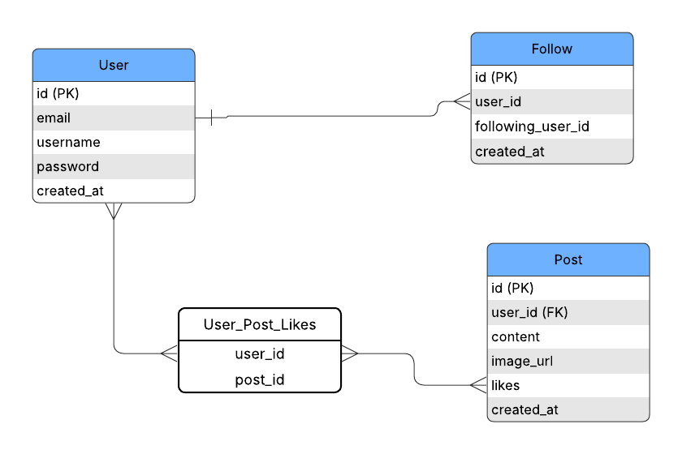

# Twitter Clone API

This project is a REST API built with Django and Django REST Framework, featuring JWT authentication (Simple JWT). Below are instructions to run the service using Docker containers, the main endpoints, and the architectural diagram.

---

## Prerequisites

- *Docker* installed
- *Docker Compose* installed

---

## Running with Docker

1. In the project root, duplicate the example env file and update it:
   ```bash
   cp env-example .env
   # Edit .env with SECRET_KEY and database settings
   ```

2. Build and start the containers in detached mode:
   ```bash
   docker-compose build
   docker-compose up -d
   ```

3. To stop and remove containers:
   ```bash
   docker-compose down
   ```

---

## Main Endpoints

| Method           | Route                        | Description                            |
|------------------|------------------------------|----------------------------------------|
| POST             | `/api/token/`                | Obtain JWT access and refresh tokens   |
| POST             | `/api/token/refresh/`        | Refresh the access token               |
| GET, POST        | `/api/users/`                | List or create users                   |
| GET, PUT, DELETE | `/api/users/{id}/`           | Retrieve, update, or delete a user     |
| GET, POST        | `/api/posts/`                | List or create posts                   |
| GET, PUT, DELETE | `/api/posts/{id}/`           | Retrieve, update, or delete a post     |
| POST             | `/api/follow/{id}/follow/`   | Follow the specified user              |
| POST             | `/api/follow/{id}/unfollow/` | Unfollow the specified user            |
| GET              | `/api/schema/`               | Serve the OpenAPI schema JSON          |
| GET              | `/api/schema/swagger-ui/`    | Swagger UI for API exploration         |

> The base URL is `http://localhost:8000/` by default.

---

## Architecture Diagram



*The diagram above (located at `docs/diagram.png`) shows the main entities and their relationships.*